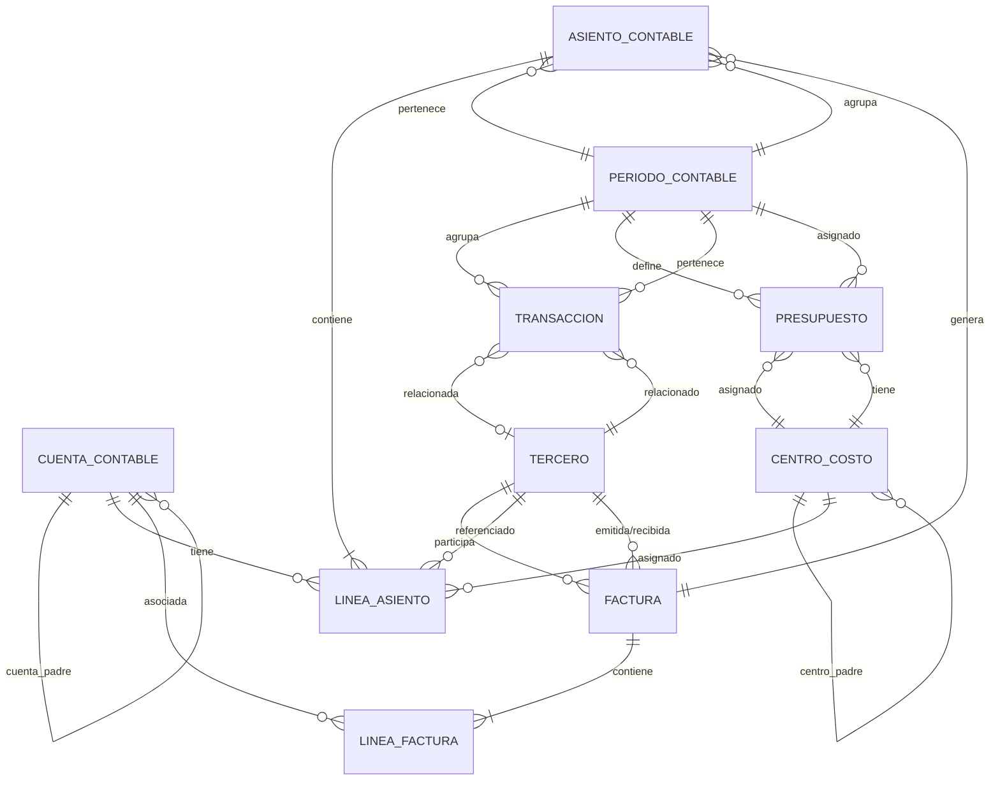

# OpenFinanceKit

**Documento:** Diccionario de Datos

**Versión:** 0.1.0

**Estado:** Draft

**Sprint:** Sprint 1

**Autor:** Gustavo Echeverría

**Última actualización:** 2026-08-03

---

## Entidades

### Resumen de Entidades

| # | Entidad | Descripción | Esquema |
|---|---------|-------------|---------|
| 1 | Cuenta Contable | Clasificación jerárquica del plan de cuentas | `accounting` |
| 2 | Asiento Contable | Registro de movimientos bajo partida doble | `accounting` |
| 3 | Línea de Asiento | Detalle individual (débito o crédito) de un asiento | `accounting` |
| 4 | Factura | Documento comercial de compra o venta | `billing` |
| 5 | Línea de Factura | Detalle de productos/servicios en una factura | `billing` |
| 6 | Presupuesto | Plan de asignación de recursos financieros | `budget` |
| 7 | Transacción | Movimiento individual de fondos | `treasury` |
| 8 | Período Contable | Intervalo temporal para agrupación de operaciones | `accounting` |
| 9 | Centro de Costo | Unidad organizacional para asignación de gastos | `accounting` |
| 10 | Tercero | Cliente, proveedor o entidad externa relacionada | `common` |

---

## Atributos

### 1. Cuenta Contable (`cuenta_contable`)

| Atributo | Tipo | Descripción | Nullable | Restricciones |
|----------|------|-------------|----------|---------------|
| `id` | UUID | Identificador único interno | No | PK |
| `codigo` | VARCHAR(20) | Código jerárquico contable (ej: 1.1.01.001) | No | UNIQUE, formato validado |
| `nombre` | VARCHAR(150) | Nombre descriptivo de la cuenta | No | — |
| `tipo` | ENUM | Tipo de cuenta: ACTIVO, PASIVO, PATRIMONIO, INGRESO, GASTO | No | Valores definidos |
| `naturaleza` | ENUM | Naturaleza del saldo: DEUDORA, ACREEDORA | No | Derivada del tipo |
| `nivel` | INTEGER | Nivel jerárquico (1=grupo, 2=subgrupo, etc.) | No | >= 1 |
| `cuenta_padre_id` | UUID | Referencia a la cuenta padre en la jerarquía | Sí | FK → cuenta_contable.id |
| `activa` | BOOLEAN | Indica si la cuenta acepta movimientos | No | DEFAULT true |
| `descripcion` | TEXT | Descripción detallada del uso de la cuenta | Sí | — |
| `created_at` | TIMESTAMP | Fecha de creación del registro | No | DEFAULT NOW() |
| `updated_at` | TIMESTAMP | Fecha de última actualización | No | DEFAULT NOW() |

### 2. Asiento Contable (`asiento_contable`)

| Atributo | Tipo | Descripción | Nullable | Restricciones |
|----------|------|-------------|----------|---------------|
| `id` | UUID | Identificador único interno | No | PK |
| `numero` | INTEGER | Número secuencial dentro del período | No | UNIQUE por período |
| `fecha` | DATE | Fecha del asiento contable | No | Dentro del período activo |
| `descripcion` | VARCHAR(500) | Descripción o glosa del asiento | No | — |
| `periodo_id` | UUID | Período contable al que pertenece | No | FK → periodo_contable.id |
| `estado` | ENUM | Estado: BORRADOR, VALIDADO, ANULADO | No | DEFAULT 'BORRADOR' |
| `tipo` | ENUM | Tipo: APERTURA, OPERACION, AJUSTE, CIERRE | No | — |
| `referencia_origen` | VARCHAR(100) | Referencia al documento origen (factura, etc.) | Sí | — |
| `created_by` | UUID | Usuario que creó el asiento | No | FK → usuario.id |
| `created_at` | TIMESTAMP | Fecha de creación del registro | No | DEFAULT NOW() |
| `updated_at` | TIMESTAMP | Fecha de última actualización | No | DEFAULT NOW() |

### 3. Línea de Asiento (`linea_asiento`)

| Atributo | Tipo | Descripción | Nullable | Restricciones |
|----------|------|-------------|----------|---------------|
| `id` | UUID | Identificador único interno | No | PK |
| `asiento_id` | UUID | Asiento contable al que pertenece | No | FK → asiento_contable.id |
| `cuenta_id` | UUID | Cuenta contable afectada | No | FK → cuenta_contable.id |
| `debe` | DECIMAL(18,2) | Monto en el debe (débito) | No | >= 0, DEFAULT 0 |
| `haber` | DECIMAL(18,2) | Monto en el haber (crédito) | No | >= 0, DEFAULT 0 |
| `descripcion` | VARCHAR(300) | Descripción de la línea | Sí | — |
| `centro_costo_id` | UUID | Centro de costo asociado | Sí | FK → centro_costo.id |
| `tercero_id` | UUID | Tercero relacionado | Sí | FK → tercero.id |
| `created_at` | TIMESTAMP | Fecha de creación del registro | No | DEFAULT NOW() |

### 4. Factura (`factura`)

| Atributo | Tipo | Descripción | Nullable | Restricciones |
|----------|------|-------------|----------|---------------|
| `id` | UUID | Identificador único interno | No | PK |
| `numero` | VARCHAR(30) | Número de factura | No | UNIQUE por serie |
| `serie` | VARCHAR(10) | Serie de la factura | No | — |
| `tipo` | ENUM | Tipo: EMITIDA, RECIBIDA | No | — |
| `fecha_emision` | DATE | Fecha de emisión de la factura | No | — |
| `fecha_vencimiento` | DATE | Fecha de vencimiento del pago | No | >= fecha_emision |
| `tercero_id` | UUID | Cliente o proveedor de la factura | No | FK → tercero.id |
| `subtotal` | DECIMAL(18,2) | Monto antes de impuestos | No | >= 0 |
| `impuestos` | DECIMAL(18,2) | Monto total de impuestos | No | >= 0 |
| `total` | DECIMAL(18,2) | Monto total de la factura | No | = subtotal + impuestos |
| `moneda` | VARCHAR(3) | Código de moneda ISO 4217 | No | DEFAULT 'USD' |
| `estado` | ENUM | Estado: BORRADOR, EMITIDA, PAGADA, ANULADA, VENCIDA | No | DEFAULT 'BORRADOR' |
| `notas` | TEXT | Notas u observaciones | Sí | — |
| `created_at` | TIMESTAMP | Fecha de creación del registro | No | DEFAULT NOW() |
| `updated_at` | TIMESTAMP | Fecha de última actualización | No | DEFAULT NOW() |

### 5. Línea de Factura (`linea_factura`)

| Atributo | Tipo | Descripción | Nullable | Restricciones |
|----------|------|-------------|----------|---------------|
| `id` | UUID | Identificador único interno | No | PK |
| `factura_id` | UUID | Factura a la que pertenece | No | FK → factura.id |
| `descripcion` | VARCHAR(300) | Descripción del producto/servicio | No | — |
| `cantidad` | DECIMAL(12,4) | Cantidad de unidades | No | > 0 |
| `precio_unitario` | DECIMAL(18,4) | Precio por unidad | No | >= 0 |
| `descuento` | DECIMAL(5,2) | Porcentaje de descuento | No | >= 0, <= 100 |
| `impuesto_porcentaje` | DECIMAL(5,2) | Porcentaje de impuesto aplicable | No | >= 0 |
| `subtotal` | DECIMAL(18,2) | Monto de la línea (cantidad × precio - descuento) | No | >= 0 |
| `cuenta_id` | UUID | Cuenta contable asociada | Sí | FK → cuenta_contable.id |
| `centro_costo_id` | UUID | Centro de costo asociado | Sí | FK → centro_costo.id |
| `created_at` | TIMESTAMP | Fecha de creación del registro | No | DEFAULT NOW() |

### 6. Presupuesto (`presupuesto`)

| Atributo | Tipo | Descripción | Nullable | Restricciones |
|----------|------|-------------|----------|---------------|
| `id` | UUID | Identificador único interno | No | PK |
| `nombre` | VARCHAR(200) | Nombre del presupuesto | No | — |
| `periodo_id` | UUID | Período fiscal del presupuesto | No | FK → periodo_contable.id |
| `centro_costo_id` | UUID | Centro de costo principal | No | FK → centro_costo.id |
| `monto_total` | DECIMAL(18,2) | Monto total asignado | No | > 0 |
| `monto_ejecutado` | DECIMAL(18,2) | Monto ejecutado acumulado | No | >= 0, DEFAULT 0 |
| `monto_comprometido` | DECIMAL(18,2) | Monto comprometido pendiente de ejecución | No | >= 0, DEFAULT 0 |
| `estado` | ENUM | Estado: BORRADOR, APROBADO, EN_EJECUCION, CERRADO | No | DEFAULT 'BORRADOR' |
| `descripcion` | TEXT | Descripción del presupuesto | Sí | — |
| `created_at` | TIMESTAMP | Fecha de creación del registro | No | DEFAULT NOW() |
| `updated_at` | TIMESTAMP | Fecha de última actualización | No | DEFAULT NOW() |

### 7. Transacción (`transaccion`)

| Atributo | Tipo | Descripción | Nullable | Restricciones |
|----------|------|-------------|----------|---------------|
| `id` | UUID | Identificador único (UUID v4) | No | PK |
| `fecha` | TIMESTAMP | Fecha y hora de la transacción | No | — |
| `tipo` | ENUM | Tipo: INGRESO, EGRESO, TRANSFERENCIA | No | — |
| `monto` | DECIMAL(18,2) | Monto de la transacción | No | > 0 |
| `moneda` | VARCHAR(3) | Código de moneda ISO 4217 | No | DEFAULT 'USD' |
| `descripcion` | VARCHAR(500) | Descripción de la transacción | No | — |
| `cuenta_origen_id` | UUID | Cuenta bancaria de origen | Sí | FK → cuenta_bancaria.id |
| `cuenta_destino_id` | UUID | Cuenta bancaria de destino | Sí | FK → cuenta_bancaria.id |
| `periodo_id` | UUID | Período contable al que pertenece | No | FK → periodo_contable.id |
| `tercero_id` | UUID | Tercero relacionado | Sí | FK → tercero.id |
| `estado` | ENUM | Estado: PENDIENTE, CONCILIADA, ANULADA | No | DEFAULT 'PENDIENTE' |
| `referencia` | VARCHAR(100) | Referencia externa (número de cheque, ref. bancaria) | Sí | — |
| `created_at` | TIMESTAMP | Fecha de creación del registro | No | DEFAULT NOW() |
| `updated_at` | TIMESTAMP | Fecha de última actualización | No | DEFAULT NOW() |

### 8. Período Contable (`periodo_contable`)

| Atributo | Tipo | Descripción | Nullable | Restricciones |
|----------|------|-------------|----------|---------------|
| `id` | UUID | Identificador único interno | No | PK |
| `anio` | INTEGER | Año fiscal | No | > 2000 |
| `mes` | INTEGER | Mes del período (1-12) | No | 1 <= mes <= 12 |
| `nombre` | VARCHAR(50) | Nombre descriptivo (ej: "Enero 2025") | No | — |
| `fecha_inicio` | DATE | Fecha de inicio del período | No | — |
| `fecha_fin` | DATE | Fecha de fin del período | No | > fecha_inicio |
| `estado` | ENUM | Estado: ABIERTO, CERRADO, EN_CIERRE | No | DEFAULT 'ABIERTO' |
| `created_at` | TIMESTAMP | Fecha de creación del registro | No | DEFAULT NOW() |
| `updated_at` | TIMESTAMP | Fecha de última actualización | No | DEFAULT NOW() |

### 9. Centro de Costo (`centro_costo`)

| Atributo | Tipo | Descripción | Nullable | Restricciones |
|----------|------|-------------|----------|---------------|
| `id` | UUID | Identificador único interno | No | PK |
| `codigo` | VARCHAR(20) | Código jerárquico del centro de costo | No | UNIQUE |
| `nombre` | VARCHAR(150) | Nombre del centro de costo | No | — |
| `nivel` | INTEGER | Nivel jerárquico | No | >= 1 |
| `centro_padre_id` | UUID | Centro de costo padre | Sí | FK → centro_costo.id |
| `responsable` | VARCHAR(200) | Nombre del responsable | Sí | — |
| `activo` | BOOLEAN | Indica si el centro está activo | No | DEFAULT true |
| `presupuesto_anual` | DECIMAL(18,2) | Presupuesto anual asignado | Sí | >= 0 |
| `created_at` | TIMESTAMP | Fecha de creación del registro | No | DEFAULT NOW() |
| `updated_at` | TIMESTAMP | Fecha de última actualización | No | DEFAULT NOW() |

### 10. Tercero (`tercero`)

| Atributo | Tipo | Descripción | Nullable | Restricciones |
|----------|------|-------------|----------|---------------|
| `id` | UUID | Identificador único interno | No | PK |
| `tipo_documento` | ENUM | Tipo de identificación: NIF, RUC, RFC, PASAPORTE, OTRO | No | — |
| `numero_documento` | VARCHAR(30) | Número de identificación fiscal | No | UNIQUE por tipo |
| `razon_social` | VARCHAR(300) | Nombre legal o razón social | No | — |
| `nombre_comercial` | VARCHAR(200) | Nombre comercial (si difiere) | Sí | — |
| `tipo` | ENUM | Tipo: CLIENTE, PROVEEDOR, AMBOS | No | — |
| `email` | VARCHAR(254) | Correo electrónico principal | Sí | Formato email válido |
| `telefono` | VARCHAR(20) | Teléfono principal | Sí | — |
| `direccion` | TEXT | Dirección fiscal | Sí | — |
| `activo` | BOOLEAN | Indica si el tercero está activo | No | DEFAULT true |
| `created_at` | TIMESTAMP | Fecha de creación del registro | No | DEFAULT NOW() |
| `updated_at` | TIMESTAMP | Fecha de última actualización | No | DEFAULT NOW() |

---

## Relaciones

### Diagrama Entidad-Relación

### Descripción de Relaciones

| Relación | Cardinalidad | Descripción |
|----------|--------------|-------------|
| Cuenta Contable → Cuenta Contable | 1:N (auto-referencia) | Jerarquía del plan de cuentas; una cuenta padre puede tener múltiples cuentas hijas |
| Asiento Contable → Línea de Asiento | 1:N (mín. 2) | Un asiento debe tener al menos dos líneas (partida doble) |
| Asiento Contable → Período Contable | N:1 | Cada asiento pertenece a exactamente un período |
| Factura → Línea de Factura | 1:N (mín. 1) | Una factura tiene al menos una línea de detalle |
| Factura → Tercero | N:1 | Cada factura está asociada a un tercero (cliente o proveedor) |
| Factura → Asiento Contable | 1:N | Una factura puede generar uno o más asientos contables |
| Presupuesto → Período Contable | N:1 | Cada presupuesto corresponde a un período fiscal |
| Presupuesto → Centro de Costo | N:1 | Cada presupuesto se asigna a un centro de costo |
| Transacción → Período Contable | N:1 | Cada transacción pertenece a un período contable |
| Transacción → Tercero | N:0..1 | Una transacción puede estar relacionada con un tercero |
| Centro de Costo → Centro de Costo | 1:N (auto-referencia) | Jerarquía de centros de costo |
| Línea de Asiento → Cuenta Contable | N:1 | Cada línea referencia una cuenta contable |
| Línea de Asiento → Centro de Costo | N:0..1 | Opcionalmente asociada a un centro de costo |
| Línea de Asiento → Tercero | N:0..1 | Opcionalmente referencia a un tercero |

---

## Restricciones

### Restricciones de Integridad

| # | Entidad | Restricción | Tipo | Descripción |
|---|---------|-------------|------|-------------|
| R1 | Asiento Contable | Partida doble | Negocio | La suma de débitos debe ser igual a la suma de créditos en cada asiento |
| R2 | Asiento Contable | Mínimo de líneas | Negocio | Todo asiento debe tener al menos 2 líneas |
| R3 | Asiento Contable | Período activo | Negocio | Solo se pueden crear asientos en períodos con estado ABIERTO |
| R4 | Línea de Asiento | Exclusividad debe/haber | Datos | Una línea no puede tener valores > 0 simultáneamente en debe y haber |
| R5 | Factura | Coherencia de montos | Datos | total = subtotal + impuestos |
| R6 | Factura | Fecha de vencimiento | Datos | fecha_vencimiento >= fecha_emision |
| R7 | Presupuesto | Control de ejecución | Negocio | monto_ejecutado + monto_comprometido <= monto_total (configurable como alerta o bloqueo) |
| R8 | Período Contable | No solapamiento | Datos | Los períodos no pueden superponerse en fechas |
| R9 | Período Contable | Secuencia | Negocio | No se puede abrir un período si el anterior no está cerrado |
| R10 | Cuenta Contable | Movimientos en hojas | Negocio | Solo las cuentas de último nivel (hojas) aceptan movimientos directos |
| R11 | Transacción | Cuentas en transferencia | Datos | Si tipo = TRANSFERENCIA, tanto cuenta_origen_id como cuenta_destino_id son obligatorios |
| R12 | Tercero | Unicidad de documento | Datos | La combinación tipo_documento + numero_documento debe ser única |
| R13 | Centro de Costo | Sin ciclos | Datos | La jerarquía de centros de costo no puede contener referencias circulares |
| R14 | Cuenta Contable | Sin ciclos | Datos | La jerarquía de cuentas no puede contener referencias circulares |

### Restricciones de Auditoría

| # | Restricción | Descripción |
|---|-------------|-------------|
| A1 | Inmutabilidad de asientos validados | Un asiento con estado VALIDADO no puede ser modificado; solo puede ser anulado |
| A2 | Trazabilidad de cambios | Toda modificación debe registrar el usuario y la fecha del cambio |
| A3 | No eliminación física | Los registros financieros no se eliminan; se anulan mediante cambio de estado |
| A4 | Secuencia de numeración | Los números de asiento y factura no pueden tener gaps dentro de un período/serie |

---

## Convenciones

### Tipos de Datos

| Convención | Descripción |
|------------|-------------|
| UUID | Identificadores únicos universales v4 para todas las PKs |
| DECIMAL(18,2) | Montos monetarios con 2 decimales |
| DECIMAL(18,4) | Precios unitarios con 4 decimales para mayor precisión |
| TIMESTAMP | Fechas con zona horaria UTC |
| ENUM | Valores fijos definidos a nivel de aplicación |
| VARCHAR(n) | Textos con longitud máxima definida |
| TEXT | Textos sin límite específico de longitud |

### Nomenclatura

| Elemento | Convención | Ejemplo |
|----------|------------|---------|
| Tablas | snake_case, singular | `cuenta_contable` |
| Columnas | snake_case | `fecha_emision` |
| PKs | Siempre `id` | `id` |
| FKs | nombre_entidad_id | `periodo_id` |
| Timestamps | created_at, updated_at | — |
| Booleanos | adjetivo o participio | `activo`, `activa` |
