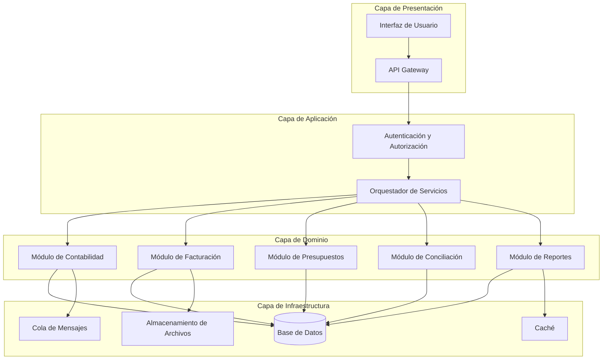

# Arquitectura del Sistema — FinanceOS

## Visión General

FinanceOS es un Sistema de Gestión Financiera diseñado para ser modular, escalable y extensible. Su objetivo principal es proporcionar una plataforma integral que permita a las organizaciones gestionar sus operaciones financieras de forma centralizada, incluyendo contabilidad, facturación, presupuestos, reportes y conciliaciones bancarias.

El sistema está concebido como una arquitectura por capas con separación clara de responsabilidades, lo que permite evolucionar cada componente de forma independiente. La arquitectura prioriza:

- **Modularidad**: Cada dominio financiero opera como un módulo independiente.
- **Extensibilidad**: Nuevos módulos pueden agregarse sin afectar los existentes.
- **Trazabilidad**: Toda operación financiera queda registrada con auditoría completa.
- **Integridad de datos**: Las transacciones financieras mantienen consistencia ACID.

---

## Principios de Diseño

Los siguientes principios guían las decisiones arquitectónicas del sistema:

### 1. Separación de Capas

El sistema se organiza en capas bien definidas (presentación, aplicación, dominio, infraestructura) donde cada capa tiene responsabilidades específicas y se comunica únicamente con las capas adyacentes.

### 2. Diseño Orientado al Dominio (DDD)

El modelo de datos y la lógica de negocio reflejan los conceptos del dominio financiero. Las entidades, agregados y servicios de dominio se modelan siguiendo el lenguaje ubicuo del negocio.

### 3. Principio de Responsabilidad Única

Cada módulo y componente tiene una única razón para cambiar. Los módulos de contabilidad, facturación y presupuestos son independientes entre sí.

### 4. Configuración sobre Convención

Las reglas de negocio financieras varían entre organizaciones. El sistema favorece la configuración parametrizable sobre el código hard-coded.

### 5. Auditoría por Defecto

Toda mutación de datos financieros genera un registro de auditoría inmutable. No se permite la eliminación física de registros contables.

### 6. Seguridad en Profundidad

La autenticación, autorización y cifrado se aplican en múltiples capas del sistema, no solo en el perímetro.

---

## Componentes

El sistema se estructura en los siguientes componentes principales:

### Descripción de Componentes

| Componente | Responsabilidad |
|-----------|----------------|
| **Interfaz de Usuario** | Capa de presentación web/móvil para interacción del usuario final |
| **API Gateway** | Punto de entrada único para todas las peticiones, manejo de rate limiting y routing |
| **Autenticación y Autorización** | Gestión de identidad, tokens, roles y permisos |
| **Orquestador de Servicios** | Coordinación de operaciones que involucran múltiples módulos |
| **Módulo de Contabilidad** | Plan de cuentas, asientos contables, libro mayor, balances |
| **Módulo de Facturación** | Emisión, recepción y gestión del ciclo de vida de facturas |
| **Módulo de Presupuestos** | Creación, seguimiento y control presupuestario |
| **Módulo de Conciliación** | Conciliación bancaria automática y manual |
| **Módulo de Reportes** | Generación de estados financieros y reportes personalizados |
| **Base de Datos** | Persistencia principal con soporte transaccional ACID |
| **Caché** | Almacenamiento en memoria para consultas frecuentes de reportes |
| **Cola de Mensajes** | Procesamiento asíncrono de operaciones no críticas en tiempo |
| **Almacenamiento de Archivos** | Gestión de documentos adjuntos (PDFs, XMLs de facturas) |

---

## Modelo de Datos

El modelo de datos del sistema está documentado en detalle en el diccionario de datos del proyecto.

👉 **Referencia completa**: [DATA_DICTIONARY.md](./DATA_DICTIONARY.md)

### Resumen de Entidades Principales

El modelo de datos se organiza alrededor de las siguientes entidades centrales del dominio financiero:

- **Cuentas Contables** — Plan de cuentas jerárquico (activo, pasivo, patrimonio, ingresos, gastos)
- **Asientos Contables** — Registros de movimientos con partida doble
- **Facturas** — Documentos comerciales emitidos y recibidos
- **Presupuestos** — Asignaciones presupuestarias por período y centro de costo
- **Transacciones Bancarias** — Movimientos importados desde entidades financieras
- **Usuarios y Roles** — Modelo de permisos y acceso al sistema

Las relaciones, atributos detallados y restricciones de integridad se encuentran en el diccionario de datos referenciado arriba.

---

## Integraciones

El sistema contempla las siguientes integraciones con servicios externos:

### Integraciones Planificadas

| Integración | Propósito | Prioridad |
|------------|-----------|-----------|
| Servicios bancarios (Open Banking) | Importación automática de movimientos bancarios | Alta |
| Facturación electrónica (SAT/SII/AFIP) | Emisión y validación de facturas fiscales | Alta |
| Pasarelas de pago | Procesamiento de cobros y pagos | Media |
| Servicios de tipo de cambio | Actualización de tasas de cambio para multi-moneda | Media |
| Almacenamiento en la nube | Respaldo y almacenamiento de documentos | Media |
| Servicios de notificación | Alertas por email, SMS y push | Baja |
| ERP externos | Sincronización con sistemas empresariales existentes | Baja |

### Patrones de Integración

- **APIs REST/GraphQL**: Para integraciones síncronas de lectura/escritura.
- **Webhooks**: Para recibir notificaciones de eventos externos en tiempo real.
- **Procesamiento por lotes**: Para conciliaciones y sincronizaciones masivas.
- **Circuit Breaker**: Para manejo de fallos en servicios externos con degradación elegante.

---

## Decisiones Pendientes

Las siguientes decisiones tecnológicas se tomarán en sprints futuros (Sprint 2+), una vez que los requisitos funcionales estén más definidos:

| Decisión | Opciones en Consideración | Sprint Estimado |
|----------|--------------------------|-----------------|
| Lenguaje backend | Por definir | Sprint 2 |
| Framework frontend | Por definir | Sprint 2 |
| Base de datos principal | Por definir (relacional vs. mixta) | Sprint 2 |
| Estrategia de autenticación | Por definir (OAuth2, JWT, etc.) | Sprint 2 |
| Infraestructura de despliegue | Por definir (cloud, on-premise, híbrida) | Sprint 3 |
| Herramienta de CI/CD | Por definir | Sprint 3 |
| Motor de caché | Por definir | Sprint 3 |
| Sistema de colas | Por definir | Sprint 3 |
| Estrategia de monitoreo | Por definir (APM, logging, alertas) | Sprint 4 |

> **Nota**: Las decisiones tecnológicas se registrarán formalmente como ADRs en el archivo [DECISIONS.md](./DECISIONS.md) a medida que se tomen.

---

*Última actualización: Sprint 1 — Scaffolding inicial del proyecto*
